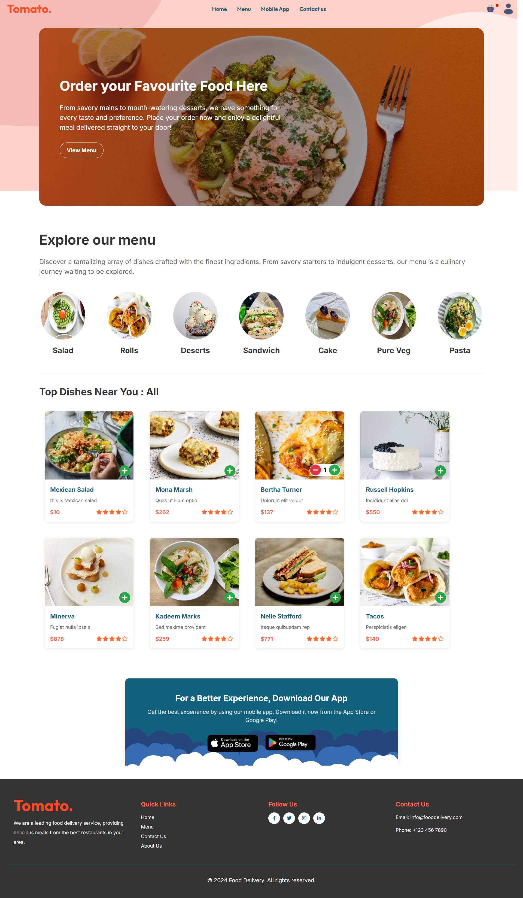
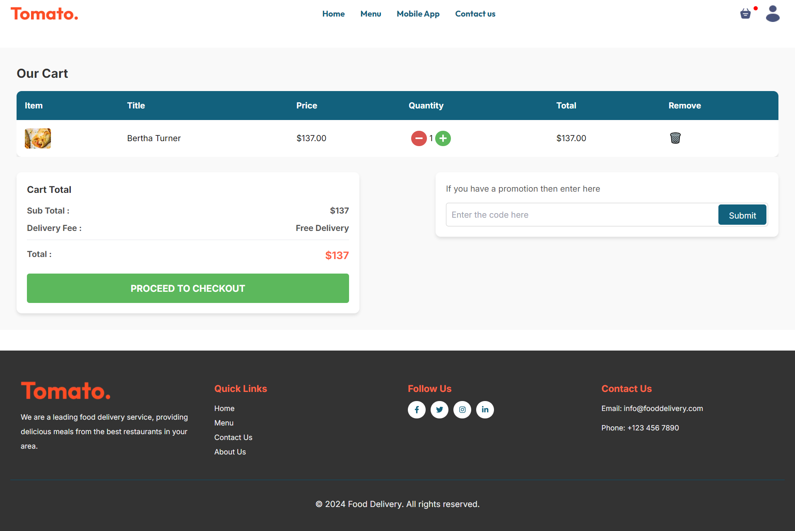
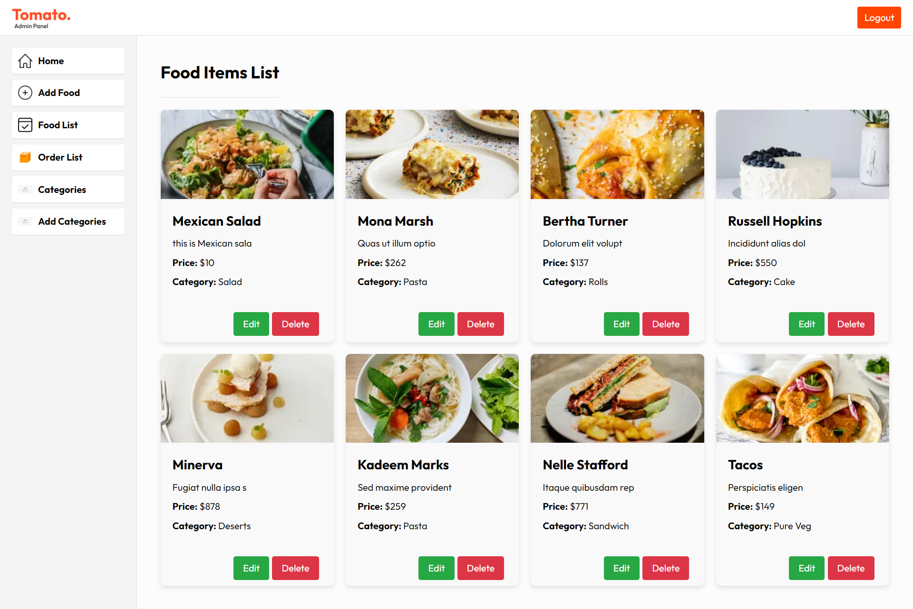
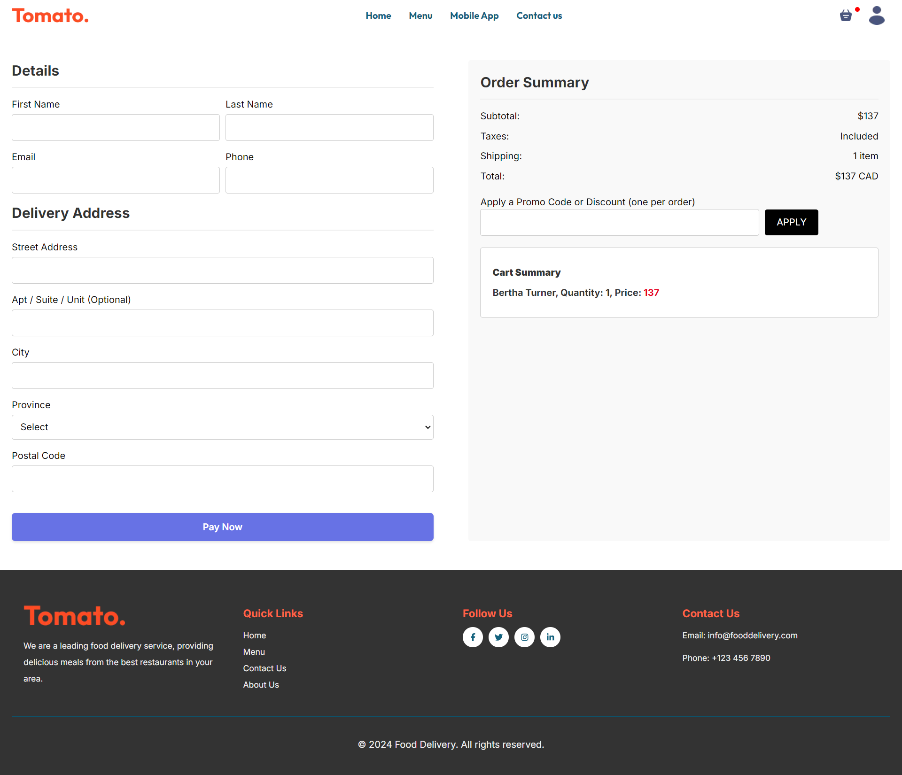
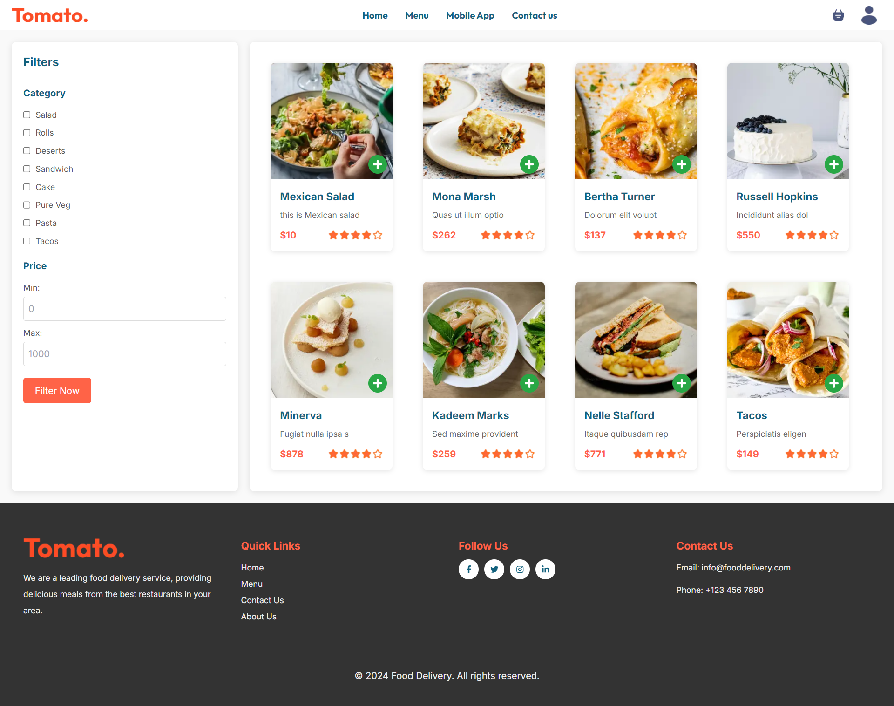

# My Next.js Project

This is a full-stack web application built using Next.js, React, Node.js, Express, and MongoDB. It features a responsive UI and robust backend services.

## Screenshots

### Homepage



### Cart



### Dashboard



### Checkout



### Menu



## Getting Started

To run this project locally, clone the repository and install dependencies using npm or yarn:

```bash
npm install
npm run dev


Open [http://localhost:3000](http://localhost:3000) with your browser to see the result.

You can start editing the page by modifying `app/page.js`. The page auto-updates as you edit the file.
```
